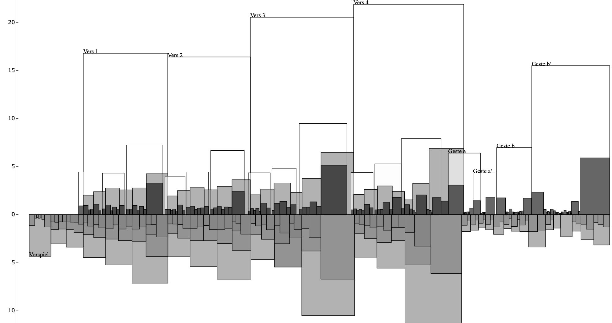
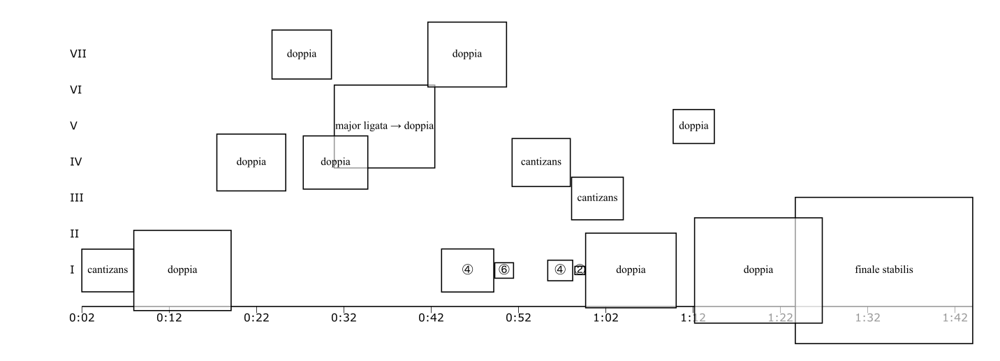
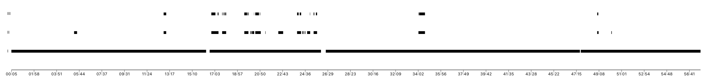

# Skyline Editor
Simple online tool to generate Skyline visualizations, cf. Hermann Gottschewski,
Die Interpretation als Kunstwerk, Laaber 1996. ([example](http://fusehime.c.u-tokyo.ac.jp/gottschewski/doc/dissgraphics/Hauptgraphik3.JPG))

Takes time instants exported as CSV from Sonic Visualiser as input data and generates SVG.

**Example 1**
SKYLINE visualization of temporal processes in Edvard Griegs *Solveig's Song* based on an early performance
by Beatrice Kernic. The lower skyline represents the accompaniment, the upper skyline the voice. 

**Example 2**
Visualization of cadential time spans of the fifth Prélude by Louis Couperin, based on an interpretation of
Christophe Rousset.

**Example 3**
Fragments of the solo violin in Mahler's 4th symphony, based on a recording by Claudio Abbado and the Vienna 
Philharmonic. The graphic was created by Pia Schumacher.

## References
Bausch, Sebastian, Gebauer, Johannes, & Vollmer, Frithjof. (2021). "SKYLINE2 (Butterfly plus)" Visualisations of Timing in Recorded Musical Performances (Excel Template). Zenodo. [https://doi.org/10.5281/zenodo.5808867](https://doi.org/10.5281/zenodo.5808867)
